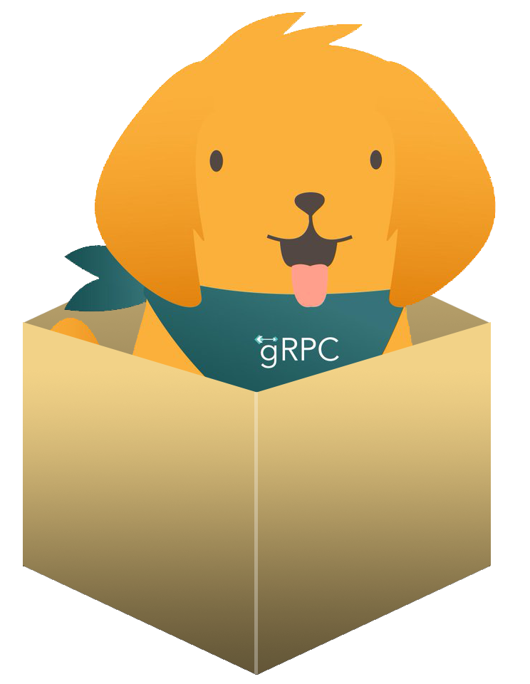

<div align="center">

</div>

# protobox

protobox simplifies gRPC source generation and dependency management for your projects.

Keep track of proto files needed from folders or external git repos. Don't have protoc and all the plugins needed to generate your source files? No problem! protobox will use a docker image as a build host so you don't have to worry about the protoc build chain.

## Installation

```bash
go get github.com/UNIwise/protobox
```

## Quick start

```bash
# Display the help page
protobox help

# Generate your source files specified in protobox.yaml
protobox generate

# Use your local protoc binaries instead of the docker build host
protobox generate --local

# Check if your system have the needed dependencies for protobox to work
protobox check

# Lint the configuration file
protobox lint
```

## Configuration

All protobox project dependencies and settings are specified in a `protobox.yaml` in the root of your project.

A simple configuration with a local proto file:

```yaml
syntax: v1

services:
  - proto: service.proto
    out: 
      - language: go
        path: gen/
```

Proto files from git:

```yaml
syntax: v1

services:
  - repo: git@github.com:UNIwise/protobox
    branch: master # optional
    commit: bcf8507c0bd7d33f54a8223c9e8fa1fd3e4a4555 # optional
    proto: examples/service.proto
    out: 
      - language: go
        path: gen/
```

Multiple target languages:

```yaml
syntax: v1

services:
  - proto: service.proto
    out: 
      - language: go
        path: gen/go
      - language: php
        path: gen/php
```

Multiple services:

```yaml
syntax: v1

services:
  - proto: service1.proto
    out: 
      - language: go
        path: gen/service1
  - proto: service2.proto
    out: 
      - language: go
        path: gen/service2

```

And of course all examples above can be combined as you please! 

## Syntax

Available languages are: `go`, `php`, `ts`, `js`, `cpp`, `python`, `java`, `ruby`.